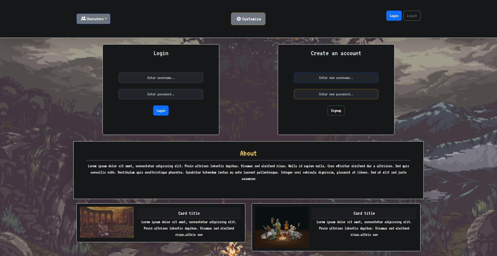
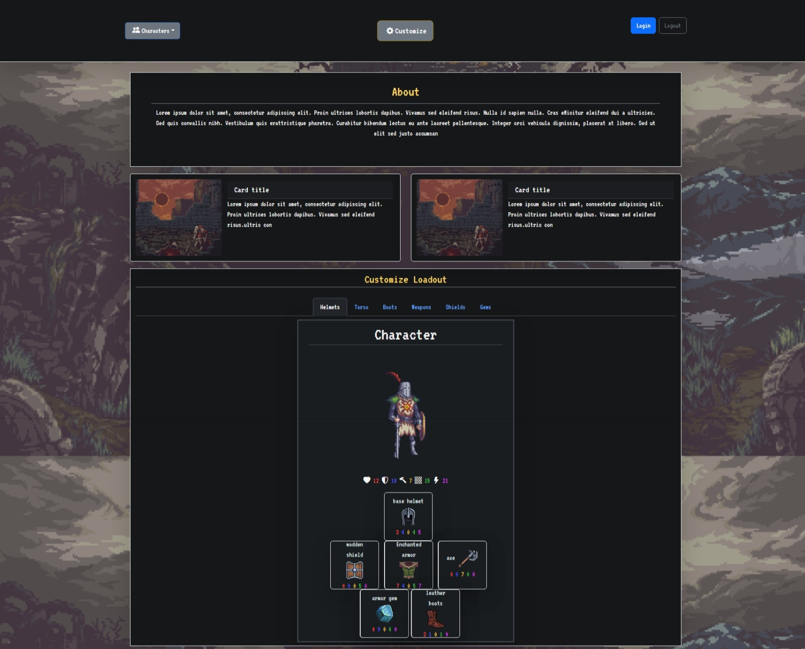

 # Armory

## Description
This project features an application where the user to build an optimum character loadout. The user can select a helmet, shield, torso armor, weapon, gem, and boots. Each of these items has various stats for health, armor, attack, defense, and speed.

## Table of Contents
- [Usage](#usage)
- [Questions](#questions)
- [Contributors](#contributors)
- [Acknowledgements](#acknowledgements)
- [Preview](#preview)

 
## Usage
The user can access the web application here: [Armory Web Application]()

Upon arriving to the web application, the user is presented with the login in screen. Here they can either login or signup. If they signup, they will be automatically logged into the application. The user is then redirected to the loadout page.

Here the user is displayed with some information and can see a character to build. The character is prepopulated with basic gear. Using the category buttons, the user can select which item they'd like to change. Depending what item type they select, a grid of items will appear. The user can then drag and drop these items into their character's loadout. When this happens, the character's loadout is update with the new item and all the total stats are recalculated.

After building the character the user can then click the save button. Upon doing so the user will be redirected to a new page that lists all their saved characters. If there is a character the user doesn't want anymore, they can click the coresponding delete button to delete that character for good.

## Questions
Questions can be received on the [Github Repository](https://github.com/mollydotwhat/mvc-armory) for this application. Please make a new issue.

## Contributors
The following people contributed to this web applciation. Click on their name to go to their github page
- [Brendan Keesling](https://github.com/KeeslingB)
- [Franklin Bradley](https://github.com/FranklinBrad)
- [Molly Salzberger](https://github.com/mollydotwhat/)
- [Lucas Wald](https://github.com/Wald14/)
- [Sean Sutter](https://github.com/seanwsutter/)

## Acknowledgements
- Gary Almes (Professor)
- Ben Martin and Katy Vincent (TAs)
- [W3School](https://www.w3schools.com/)
- [MDN Web Docs](https://developer.mozilla.org/)
- [Stack Overflow](https://stackoverflow.com)

## Preview
The following images share the application's login screen and character building page apperance:

### Login Screen

### Character Building Page
